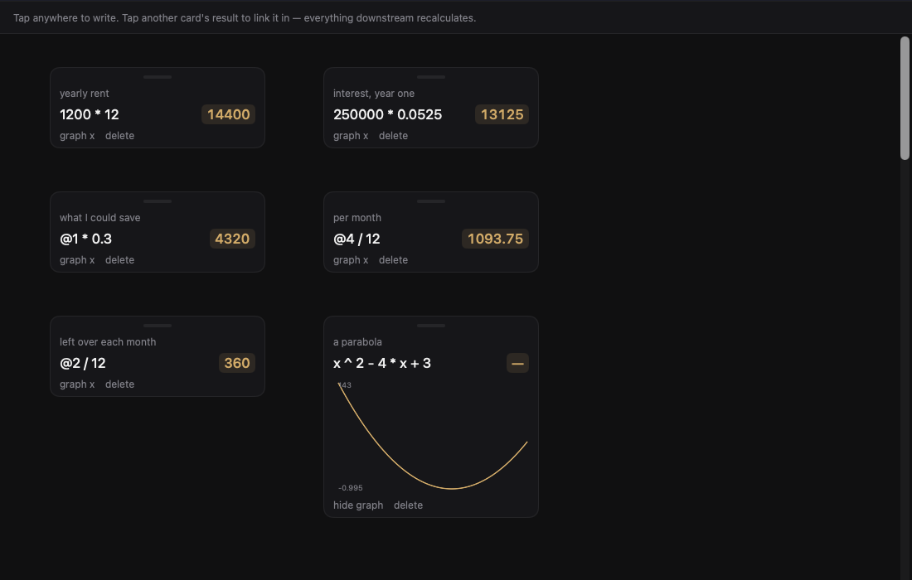
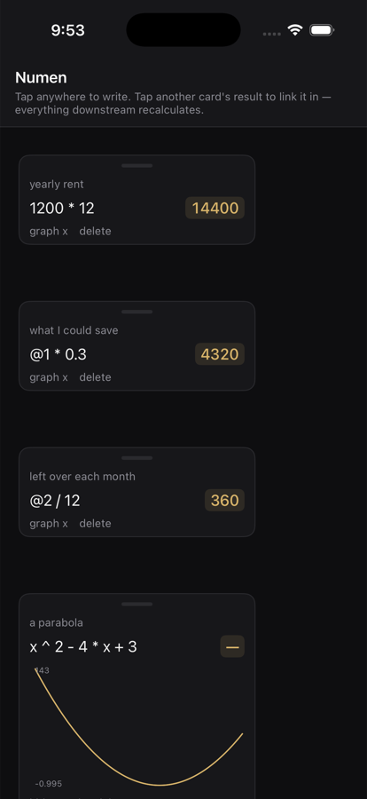

# Numen

  [](https://github.com/nulljosh/numen)


**Live:** https://numen.heyitsmejosh.com

A calculator with no rows. Write anywhere on an infinite canvas.

This is a rebuild of Tydlig, the iOS app that was discontinued. Type an expression, drag
it where you like, click any result to **link** it into what you're writing. Change a number
upstream and everything downstream follows. Any expression can plot itself over `x`.

| macOS | iOS |
|---|---|
|  |  |

- `src/lib/parse.js`: recursive-descent parser. `+ - * / ^ ( )`, numbers, `x`, `@id` links
- `src/lib/sheet.js`: the document. Evaluate, edit, walk dependencies without looping
- `src/App.jsx`: the canvas
- `src/components/Graph.jsx`: inline SVG plot

No math library. No drag library. No chart library.

```
npm i && npm test   # 7 tests over the parser + link cascade
npm run dev
```

**Terminal:** `swift build && ./.build/debug/numen-tui "2+2*sqrt(9)"` — see [tui/](tui/)
